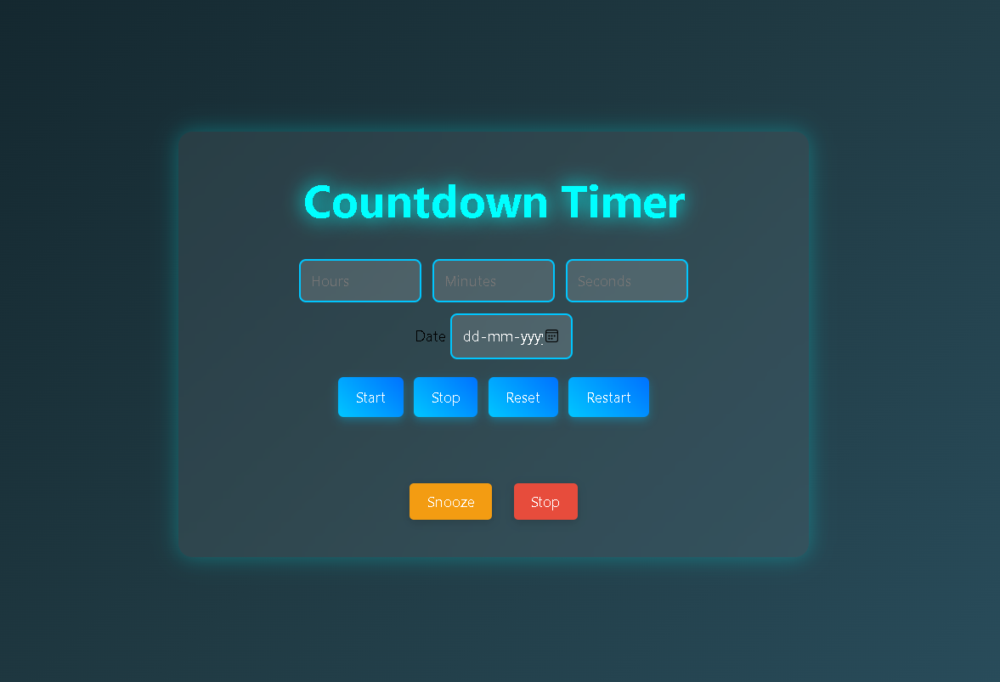

# ⏳ Countdown Timer Web App

A sleek and responsive countdown timer built with **HTML**, **CSS**, and **JavaScript**. Supports countdowns for specific hours, minutes, seconds, or a target date, with an alarm and snooze feature for expired timers.

 🚀 Features

- ⏰ Set countdowns using:
  - Hours, Minutes, and Seconds
  - Future Date
- 🔊 Built-in alarm sound on timer expiration
- 😴 Snooze and Stop alarm controls
- ♻️ Start, Stop, Reset, and Restart buttons
- 💻 Keyboard and mouse input support
- 📱 Fully responsive design for all screen sizes
- 🧪 Multiple timers can run simultaneously

 🛠️ Tech Stack

- **HTML5** – Page structure
- **CSS3** – Responsive and modern styling
- **Vanilla JavaScript** – Timer logic and interactivity

 📁 File Structure

countdown-timer/
│
├── index.html # Main HTML structure
├── style.css # UI styling and animations
├── script.js # Timer logic and alarm control
├── dhoom tune.mp3 # Alarm audio file
└── README.md # Project documentation

 📸 Preview

 💡 How to Use

1. **Clone or download** this repository.
2. Open `index.html` in your web browser.
3. Enter time values (hours, minutes, seconds) or pick a **future date**.
4. Click **Start** to begin the countdown.

 ⌨️ Controls

| Button        | Function                                |
|||
| Start         | Starts the timer(s)                      |
| Stop          | Stops all active timers and alarm        |
| Reset         | Clears all inputs and timers             |
| Restart       | Restarts the last entered configuration  |
| Snooze        | Delays the alarm sound for 15 seconds    |
| Stop (Alarm)  | Completely stops the alarm               |

 📦 Built-in Audio

- The alarm uses `dhoom tune.mp3` as a looping sound.
- Auto-looping until **Stop** or **Snooze** is pressed.

 ⚠️ Known Issues

- Browser may block audio autoplay until a user interaction occurs.
- Alarm may not trigger if the tab is inactive in some browsers.

 📌 To-Do

- Add support for recurring timers
- Save last timers in `localStorage`
- Add sound selection and volume controls

 📄 License

This project is open-source and available under the [MIT License](LICENSE).

 🙌 Acknowledgments

This timer project was created for practicing JavaScript and DOM manipulation skills, inspired by classic alarm clock apps.
